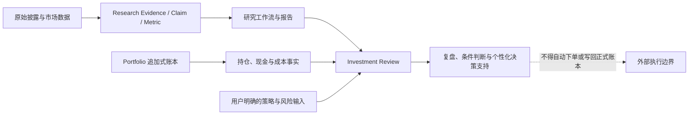

# Plan: P1.6 系统复杂度修正与判断空间恢复

## 1. 计划信息

| 字段 | 内容 |
|---|---|
| status | `completed`（bounded engineering stop；不代表 Review 产品人工验收或策略参数已确认） |
| source_diagnostic | [`docs/logs/2026-08-10_system_complexity_diagnostic.md`](../logs/2026-08-10_system_complexity_diagnostic.md) |
| execution_log | [`docs/logs/2026-08-10_system_complexity_remediation_execution_log.md`](../logs/2026-08-10_system_complexity_remediation_execution_log.md) |
| baseline | `origin/main@d21aa5a9fc4e0a8aaf77ad4d6c7ba3dd814b79d8` |
| current_stage | Research OS P1.6；Portfolio 与 Investment Review 为独立分支产品 |
| implementation_scope | `AGENTS.md`、workflow kernel、orchestration spec、policy、skills、schema、config、活动代码、测试、导航和运行产物生成逻辑均可修改 |
| execution_state | Phase 0–7 已完成：Review 默认 observation-only，P2F/行为/动机层保持 no-advice，只有显式 periodic recommendation 在用户策略输入完整时可建议；伪精确评分、current pointer/状态职责、核心事实源与 skills、普通路径/legacy、历史 CI 隔离均已修正并完成宽回归。证据耦合的主动建议与 `C-HUMAN-005` 仍停在人工暂停点 |

## 2. 背景与问题定义

当前系统已经具备可用的证据纪律、研究对象、工作流、组合会计和复盘候选能力，但存在三个不同性质的问题：

1. **活动行为错误。** Investment Review 在缺少明确风险预算时仍使用内置仓位阈值生成动作；Scorecard 也会把 TODO 表达成数字精度。
2. **活动控制面过重。** 同一完成、质量、legacy 和产品边界语义在 workflow、spec、policy 与多个 skill 中重复展开。
3. **历史外壳过大。** R5/Bundle/Patch 已退出默认权力链，却仍主导文件、测试、索引和搜索表面。

因此，计划不能只改 README 或把历史文件标成 archive；那会流于表面。它必须直接修改产生行为的代码和当前事实源，包括 `AGENTS.md`、[`RESEARCH_WORKFLOW.md`](../workflows/RESEARCH_WORKFLOW.md)、[`WORKFLOW_ORCHESTRATION_SPEC.md`](../workflows/WORKFLOW_ORCHESTRATION_SPEC.md)、两份 policy、相关 skills、schema、生成器和测试。

同时，本计划不能通过新增 `anti_recursion_policy`、复杂度评分、规则数量上限或另一轮 v13 治理合同来实现。修正对象是已有活动路径；修正证据使用已有测试、真实样本和 Git diff。

## 3. 目标与非目标

### 3.1 目标

- 在没有用户明确策略/风险输入时，Investment Review 不再制造动作和目标仓位。
- TODO、MISSING、低置信度和未披露信息不再被包装成伪精确分数或自动综合结论。
- Research、Portfolio、Investment Review 的产品职责在一个简单边界中统一，不再依赖全局规则加例外规则。
- 每类当前语义只有一个 owner；下游文档与 skills 引用 owner，不再复制整套定义。
- 普通 T0–T10/S0–S13 工作流在没有显式请求时不进入 R5/Bundle legacy evaluator。
- 新 run 的控制文件各自只承担一种职责，当前状态不再被多个文件分别手写。
- 保留证据真实性、会计一致性、时间一致性、风险和未知项；简化不得损害这些能力。
- 用少量真实研究、账本和复盘任务观察修正结果，到点停止，不再建立“去机械化完成”状态。

### 3.2 非目标

- 不追求规则、文件或代码行数的任意百分比下降。
- 不把所有投资判断变成无结构的自由文本。
- 不削弱 raw 不可覆盖、Evidence/Claim/Metric、Exposure、冲突证据、数据库事务、备份和时间边界。
- 不批量改写历史 run、历史报告、历史 readout 或合同。
- 不自动合并现有工作树，不把一个 worktree 整体覆盖到另一个分支。
- 不在本计划阶段选择用户尚未确认的精确回撤、仓位或现金参数。
- 不创建新 Gate、新全局 status、新 exception registry、新复杂度预算或长期“反递归委员会”。

## 4. 目标系统边界



建议的产品边界如下：

| 产品 | 应负责 | 不应负责 |
|---|---|---|
| Research | 证据、事实、推断、估值情景、风险、研究优先级 | 直接交易动作、仓位指令、自动执行 |
| Portfolio | 正式账本、成本、现金、持仓、行情和历史快照 | 研究命题、动机诊断、自动交易建议 |
| Investment Review | 只读消费 Portfolio 与已审核研究；在用户明确要求且提供策略/风险输入时给出有条件的个性化决策支持 | 用内置默认阈值替代用户风险选择；连接券商、下单、修改正式账本 |

这不是把 Investment Review 作为 Research no-advice 的“例外”。它是边界不同的独立产品：Research 始终不输出交易指令；Portfolio 始终只负责事实；Review 是否输出动作取决于明确模式和必要输入。没有这些输入时只能输出事实、风险、缺口、备选情景和需要用户决定的问题。

### 4.1 现有 Investment Review 分支不是三套并行系统

现有 committed 拓扑是单线祖先关系：

```text
codex/investment-review-product-completion@c3e2966
  → codex/investment-review-reviewability-corrections@c2db0d9 (+21 commits)
  → codex/investment-review-periodic-v1@aac8290 (+18 commits)
  → codex/portfolio-tracker@f56854b (+1 commit)
```

计划中的角色分配如下：

| 来源快照 | 计划角色 | 处置 |
|---|---|---|
| `codex/investment-review-product-completion@c3e2966` | facts-only/no-advice 的回归基线，用于确认简化没有损坏只读账本、sidecar 和事实报告 | 只读参照，不作为实施分支 |
| `codex/investment-review-reviewability-corrections@c2db0d9` | reviewability 功能与规则膨胀样本 | 只审查 committed 增量并定向移植 |
| `codex/investment-review-periodic-v1@aac8290` | P8–P10 报告、真实回测和 `C-HUMAN-005` 证据来源 | commits 已包含在 portfolio tip 中，不作为新的长期主分支 |
| `codex/portfolio-tracker@f56854b` | 当前 Review/Portfolio 产品线最新 committed tip | 从精确 committed tip 建立隔离集成分支 |

这三个阶段快照不需要分别实施同一修复，也不能分别维护三套 `AGENTS.md`/policy/skill。Phase 1 只在新的隔离集成分支实现一次目标行为；旧快照只作为行为与证据来源。Research `origin/main` 继续单独重构，除非未来另有明确的产品合流决定。

## 5. 核心文件重构后的唯一职责

| 当前文件/区域 | 重构后只负责 | 应移出的内容 |
|---|---|---|
| `AGENTS.md` | 全仓共享安全边界、证据诚实性、产品职责、文档优先级、数据与删除安全 | 具体 workflow 步骤、字段级状态机、legacy evaluator 细节、具体评分阈值 |
| `docs/workflows/RESEARCH_WORKFLOW.md` | 五类 workflow、阶段转换、G0–G10 的业务含义、run 关闭与回流 | schema 字段约束、CLI 实现、历史 Bundle 叙事、policy 原文复制 |
| `docs/workflows/WORKFLOW_ORCHESTRATION_SPEC.md` | 编排运行时、产物生成、接口、schema 消费和错误处理 | 再次定义投资证据纪律、质量哲学或项目完成语义 |
| `docs/policies/EVIDENCE_AND_CITATION_POLICY.md` | Evidence/Claim/Metric、来源、时点、冲突、缺失和引用 | workflow 状态、P2、发布、legacy 路由 |
| `docs/policies/QUALITY_GUARDRAILS.md` | unsupported claim/number、隐藏缺口、类型混淆、风险与报告安全 | 字数/关键词配额、项目完成状态、跨产品 advice 例外链 |
| `.agents/skills/research-orchestrator/` | 识别请求、创建/续跑 run、路由下层 skill、输出 readout | 重复定义全局 gates、完成真值和 legacy 历史 |
| `.agents/skills/quality-review/` | 执行当前 artifact 的质量检查并返回局部 issue | 维护完整历史 R5/Bundle 治理体系或决定项目级完成 |
| `.agents/skills/stock-deep-dive/` | 个股研究动作、产物与局部质量 | 全局 workflow 状态、Reader 总分、P2 或发布语义 |
| schema/config | 可机器验证的字段与兼容读取 | 研究质量哲学、自然语言规则副本 |
| tests | 验证可观察行为和数据安全 | 仅为冻结重复文案、历史路径或任意字数阈值而存在的活动断言 |

重构不设行数目标。判断一个定义是否应移除，只看它是否由另一个 owner 已经定义、当前消费者是否真正需要，以及删除副本后行为是否仍被测试覆盖。

## 6. 分阶段实施

### Phase 0：建立安全实施基线，不新增状态体系

#### 目的

先确定从哪些干净提交修改、哪些数据不能触碰，以及活动代码实际依赖哪些历史资产。此阶段不改变规则语义。

#### 动作

1. Research 从最新 `origin/main` 新建干净 `codex/` worktree。
2. Review/Portfolio 从精确 `codex/portfolio-tracker@f56854b` 新建一个隔离集成 worktree；不在三个阶段快照上重复实施修复。
3. 记录四个产品快照的精确 HEAD、祖先链和已有测试结果；completion 与 periodic-v1 作为只读基线。
4. 对 reviewability committed 增量做逐文件语义分类：可复用的职责压缩、advice 边界变化、行为代码变化、测试变化和纯历史文案；未经逐项确认不得整包应用到 `f56854b`。
5. 对 Portfolio 正式 SQLite 做只读 `quick_check`、路径确认和 SHA-256；需要迁移时沿用现有单文件备份机制。
6. 用 `rg`、import graph 和现有测试列出普通 workflow 对 R5/Bundle/Patch 的真实活动引用；区分运行时读取、测试读取、纯历史字面和显式 evaluator。
7. 标出 Research main 与产品分支冲突的 `AGENTS.md`、policy、skill 和实现；不把产品线整树合入 Research main。

#### 不新增

- `simplification_ready`；
- `anti_recursion_pass`；
- 新 G 编号；
- 新项目阶段；
- 新合同版本；
- 新长期基线 registry。

#### 验证与暂停点

- 所有实施目标从精确 committed baseline 建立；
- completion → reviewability → periodic-v1 → portfolio 的祖先链已复核，且只有一个新的 Review 集成目标；
- 正式数据库没有写入；
- 依赖清单可以回答“普通路径是否真实读取 legacy”；
- 如果来源快照边界不清，暂停该分支，不进行 stash、reset、clean 或覆盖。

### Phase 1：先修正 Investment Review 的产品边界与机械动作

#### 目的

优先停止当前唯一能直接生成 `hold/reduce` 和目标仓位区间的机械化活动路径。

#### 修改对象

- 从 `codex/portfolio-tracker@f56854b` 创建的干净 Review 集成分支；
- 目标 Review/Portfolio 分支的 `AGENTS.md`；
- `.agents/skills/investment-review/SKILL.md`；
- `docs/policies/QUALITY_GUARDRAILS.md` 中与产品边界有关的内容；
- `src/investment_review/periodic_reports.py` 及其直接调用者；
- `src/investment_review/periodic_narrative.py` 中 5%/20%/50% 的隐藏显著性阈值；
- 对应 schema、API 序列化与 tests；
- `tests/test_investment_review_recommendations.py` 等把固定动作和区间冻结为正确行为的测试；
- P10 当前参数文档只作事实输入，不改写历史结果。

completion 只提供 facts-only 行为回归，periodic-v1 提供 P8–P10 事实，reviewability committed 增量只按逐文件审查结果移植。不得在三个阶段快照分别做同一修复后再尝试合并。

#### 行为修正

1. 根 `AGENTS.md` 使用“Research / Portfolio / Review 三产品边界”取代“全局禁止 + Review 例外”或“全局允许建议”两种互相覆盖的写法。
2. Review 接受显式 `review_mode` 和用户确认的策略/风险输入；不提供时，报告只输出事实、风险、未知、情景与待决定问题。
3. 删除以下内置默认推导：

   ```text
   top_weight > 20% or cash_weight < 5% → reduce
   ```

4. 删除缺少用户边界时自动生成的 5%–10%、8%–12%、12%–18% 等目标区间。
5. 如果用户已经明确输入仓位/现金/回撤纪律，报告必须标明“用户既定边界触发”；Agent 的联合判断与用户规则分开呈现。
6. 基本面、市场、板块、相对强弱、趋势和流动性必须参与动作形成，而不是只在阈值已经决定动作后补充理由。
7. `C-HUMAN-005` 保持未决定；P10 不支持的纯 20% 机械开关不得作为默认值回流代码。
8. Review 永远不连接券商、不下单、不修改 Portfolio 正式账本，只写派生报告或 sidecar。
9. `periodic_narrative.py` 中现金 5%、单票 20%、前三大 50% 只能在用户策略明确输入时作为用户规则；没有输入时展示实际数值和上下文，不以隐藏阈值决定“重要风险”。
10. P10 的 20/25/30 与 25/30/35 阶梯保留在 `drawdown_validation.py` 和历史 readout 中，作为预注册实验而不是活动默认策略；修正 live 建议逻辑不等于删除历史实验。
11. 既有 619 份派生报告、P8 被否决样稿和 P9 未验收样稿保持历史不可变；旧 action 只作历史快照，不能被 UI/API 当作当前有效建议，也不批量重写。

#### 保留能力

- Portfolio 的现金、持仓、集中度和历史回撤计算；
- Review 的事实整理、组合风险贡献、备选情景与条件性判断；
- 用户明确授权后的个性化决策支持；
- 所有数据截止时间、证据、风险、失效条件和缺失项。

#### 验证

用现有测试框架增加局部行为测试：

1. 缺少风险预算时，输出没有 `buy/sell/hold/add/reduce/exit` 和目标仓位；
2. 提供用户边界时，只消费输入值，不回落到隐藏默认阈值；
3. 改变基本面/板块/趋势证据可以改变条件判断，而不是只改变 explanation；
4. 正式 SQLite 的 hash 与 `quick_check` 不变；
5. sidecar 和报告没有未来信息泄漏；
6. 没有订单、券商或自动执行调用。

#### 暂停点

代码可以在 observation-only 模式完成，但精确回撤或仓位参数必须停在用户选择处。不能因为测试需要一个数字就替用户确认参数。

#### 2026-08-10 执行注记

Phase 1 已先完成最重要的行为修正：普通和定时周期报告默认进入 `observation_only`，不再生成动作、目标仓位或 5%/20%/50% 隐藏风险分类；只有单份报告明确收到 `review_mode=advice`、用户投资期限、风险预算和仓位约束时，才允许按用户边界形成 `user_policy_trigger`。无 `mode` 的旧报告在 API/UI/Markdown 中只显示为历史建议快照，不再冒充当前有效建议。

本轮没有宣称“Agent 联合判断”已经完成。当前结构化上下文只能证明信息是否存在，不能可靠表达基本面、板块和趋势对动作方向的支持或反对；为通过测试而新增一套方向评分会重新制造伪精确。因此，自动或批量 advice 仍不启用，`C-HUMAN-005` 仍未决定。详细证据见本计划的 execution log。

最终调用面复核同时关闭了旧 P2F episode interpretation 的 advice 旁路：该模型解释/人工修订路径没有 `review_mode`、风险预算或用户策略输入，因此 schema、validator、prompt、renderer 和测试统一保持 `no_advice=true`。这不会影响独立 periodic recommendation 在显式 advice 与完整用户输入下工作。

### Phase 2：移除研究输出中的伪精确

#### 2.1 Scorecard

修改对象包括 stock/segment scorecard schema、模板、`stock-deep-dive`、`quality-review`、生成器和测试。

1. Evidence 为 `TODO`、`MISSING`、`UNVERIFIED` 或仅有低置信度占位时，优先使用已有空值/缺失语义，不强制填数字。
2. 如果分数来自 Analyst Judgment，必须明确类型、依据和置信度；不能伪装成证据事实。
3. 未评分维度不进入合计；关键维度缺失时，不自动推出 `deep_watch` 等综合状态。
4. `deep_watch` 如保留，必须明示为研究优先级，不是交易动作。
5. “连续两期未披露”改为证据刷新触发器；只有反面事实才能形成 Thesis Invalidation。
6. 不新建另一套“uncertainty score”来替代旧分数。

验证使用现有 002837 与至少一个不同类型的 stock 样本：TODO 不再对应伪精确数字；已证实维度仍可比较；报告与 evidence 链不受损；缺失不会自动导出综合结论。

#### 2.2 Reader rubric

1. 普通报告质量保留引用断裂、unsupported number、隐藏 TODO、空/损坏报告、Claim 类型混淆和 Research no-advice 检查。
2. 82/45 分阈值、最低总字数、固定章节字数、引用配额和关键词比例不得回到默认路径。
3. 旧 rubric、fixture 和分数作为显式 legacy evaluator 或历史证据保留；不批量删除，不重写历史成绩。
4. 不创建一套新的“更聪明 Reader 总分”。报告洞察和可读性由最终报告人工审阅承担。

#### 暂停点

如果 nullable score 会破坏现有消费者，先更新消费者和 schema 兼容读取，再更改生成器；不得为保持旧接口而继续生成虚假数字。

#### 2026-08-10 执行注记

Phase 2 已按暂停点完成。唯一活动评分契约 `config/scoring_frameworks.yaml` 现在区分 `analyst_judgment` 与 `unscored`；只有占位证据的维度使用 `score: null`，0 只代表有证据支持的极弱评估。系统不求总分；`final_priority` 保留为定性研究排队判断，并明示不是分数聚合或交易信号。

当前 002837、300731 和细分评分卡已按新语义更新。旧 P1 builder 从 6/4 维补齐为 8/9 维，避免重跑时回退结构。`kill_switches` 已从当前评分卡和生成器移除；“连续两期未找到披露”回到现有 watchlist trigger，只触发补证与重评，不自动等同命题失效或机械下调分数。如果分析者因长期缺失披露而调整置信度或评分，仍需说明时间预期、披露边界和证据覆盖，不得把“未披露”写成“业务不存在”。三份当前 2026-07-01 P1 报告只定点同步了评分展示/缺失披露解释，并显式注明语义修正；原始证据快照、report_date、其他报告结论和 `reports/workflow_runs/**` 未改写。

Reader rubric 的 82/45 分、字数/引用/关键词配额经调用链审计，只存在显式 R5 历史 evaluator 与其回归测试中；普通 T0–T10 和当前 `stock_report_quality_review.py` 均不会调用，因此本批次没有新建替代 rubric、Gate 或退役字段。验证证据见 execution log。

### Phase 3：收束当前事实入口与状态职责

#### 目的

让人和机器从同一现有 owner 到达当前 run，不创建第三个 index 或同步 Gate。

#### 动作

1. README 的 current-run 导航直接指向 `config/r5_readout_canonical_index.yaml` 的 `current_runs` 与对应 `workflow_readout.md`。
2. `reports/p1_6/R5_READOUT_CANONICAL_INDEX.md` 明确标为历史 R5/Patch/Bundle readout 目录，不再承担整个项目 current-run 指针。
3. 不批量改写历史 readout；只改变入口描述和以后生成的链接。
4. 审计 run-local 字段职责，优先采用以下收缩：

   - `workflow_state.status` 表达这个 run 的状态；
   - `final_report_review` 绑定这个报告及其 hash；
   - `system_v1_complete` 属于项目集成/发布事实，不再复制到每个研究 run；
   - `p2_ready` 属于 comparison-readiness 的实际输出，不由单只股票 run 保存全局副本；
   - `sample_quality_ready` 如可由当前自动质量与 final review 推导，则只保留一个派生 owner，不在多份文件手写。

5. 对旧 schema 只提供最小只读兼容；不得让 legacy 字段继续成为新 run 的 canonical 写入要求。

#### 验证

- 从 README 沿链接可以唯一到达 YAML 所指 current run；
- 修改一次 state 后，人类 readout 由同一结构化状态生成；
- 旧 run 仍可读取；
- 没有新增 status enum、第三个 index 或 index-sync validator。

#### 暂停点

状态字段移除前必须先列出消费者并迁移。若字段仍服务一个真实独立决策，就保留在该决策 owner；不能为了“少字段”合并不同事实。

#### 2026-08-11 执行注记

Phase 3 已完成。跨 run 选择只由 `config/r5_readout_canonical_index.yaml.current_runs` 提供 pointer，pointer 不再复制 `status`；run 内状态仍由其 `workflow_state.yaml` 负责，人类 readout 只是投影。README 和 `docs/index.md` 只链接 pointer，不冻结具体 workflow ID/status；历史 `R5_READOUT_CANONICAL_INDEX.md` 已明确为历史目录。未来普通 run 模板不再写 `system_v1_complete`、`p2_ready`、`release_ready`、可派生的自动质量布尔值或嵌套 final-review decision；旧 run 和固定 replay 工件保持字节不变并由 validator 只读兼容。没有新增 index、同步 Gate 或状态枚举。

### Phase 4：实质重构 AGENTS、工作流内核、policy 与 skills

#### 目的

把重复语义移回唯一 owner，直接缩小活动规则面，而不是只给历史文件贴标签。

#### 修改顺序

每次只迁移一种语义，并在同一小批次更新 owner、引用方和测试：

1. **产品边界批次：** `AGENTS.md` 定义 Research/Portfolio/Review；policy 与 skill 删除互相覆盖的全局例外。
2. **证据语义批次：** `EVIDENCE_AND_CITATION_POLICY.md` 保留来源、时点、Claim/Metric、冲突与缺失；workflow/skills 改为链接和执行要求。
3. **质量语义批次：** `QUALITY_GUARDRAILS.md` 保留 unsupported/hidden gap/type/risk 等不变量；删除项目完成与 Reader 配额。
4. **workflow 语义批次：** `RESEARCH_WORKFLOW.md` 只保留五类 workflow、阶段、G0–G10、回流与 close；字段级约束交给 schema/spec。
5. **运行时批次：** `WORKFLOW_ORCHESTRATION_SPEC.md` 与 schema 只定义编排接口和产物生成，不重述质量哲学。
6. **skill 批次：** orchestrator、quality-review、stock-deep-dive 等只保留动作、输入、输出、失败回流和 owner 引用。
7. **测试批次：** 把“某段文字/旧路径必须存在”的活动断言替换为可观察行为测试；历史 replay 测试保持显式隔离。

#### 使用现有 owner，不新增 registry

[`DOC_OWNERSHIP_MATRIX.md`](../meta/DOC_OWNERSHIP_MATRIX.md)已经提供职责矩阵。实施时直接修正它与实际文件的偏差；不要另建 rule registry、exception registry 或 semantic sync database。

#### 验证

- 搜索同一关键语义时，只有 owner 给出完整定义；其他文件只引用或说明本地执行动作；
- 删除一个副本不会改变运行行为；
- 现有 focused tests 与 full test 通过；
- 真实研究输出仍保留证据、未知、反证和限制；
- 不以行数减少作为通过条件。

#### 暂停点

每个语义批次单独提交和复核。一个批次发现行为不明确时，只暂停该批次，不用新合同冻结整个系统，也不在同一提交顺手重写下一层。

#### 2026-08-11 执行注记

Phase 4 已完成实现。`AGENTS.md` 现在只保留三产品边界、证据诚实性、路径/数据安全及直接删除约束；kernel 负责 ordinary run、G0–G10、TODO/backflow/outcome；orchestration spec 只负责运行时投影；quality policy 只保留质量原则和人工边界；schema/reference 承担字段合同。orchestrator、quality-review、stock-deep-dive 等 skill 改为按任务逐步加载 owner/reference，不再复制四布尔、final-review 真值表、Bundle/R5 清单或长期治理叙事。修改后的八个 skill 均通过结构验证。

### Phase 5：缩小普通运行控制面并与 legacy 真正解耦

#### 目的

让当前文档中“legacy 退出默认路由”的声明落实到活动 import、CLI、测试与产物生成。

#### 普通路径

以下普通任务不得在未显式请求时加载 R5/Bundle/Patch：

```text
stock_first_closed_loop
segment_to_stock_closed_loop
segment_stock_interlock
report generation
quality review
close
```

只有调用者明确请求 business-line driver、operating evidence、peer eligibility、model link 或 legacy benchmark 时，才运行对应局部 evaluator。它只能返回局部 capability 的 pass/limitation/defect，不能写 canonical outcome。

#### 新 run 的控制文件职责

| 文件 | 单一职责 |
|---|---|
| `workflow_state.yaml` | 当前结构化 run 状态 |
| `workflow_readout.md` | 由 state 生成的人类投影 |
| `run_log.md` | 已发生事件，不重新总结全部当前状态 |
| `artifact_manifest.csv` | 产物、来源与必要 hash，不重新决定 outcome |
| `open_todos.csv` | 真实未决 issue 与影响，不复制完整质量报告 |
| `quality_gate_report.md` | 检查证据与局部结果，不重新定义项目完成 |

审查 hash/receipt 的适用边界：raw evidence、正式数据库变更、最终报告人审和发布产物继续使用强绑定；普通可重建中间件不再因为历史发布证明而自动产生多层 receipt。是否移除某个 receipt 取决于其真实消费者，不以文件数为目标。

#### 验证

1. 从当前 evidence 跑一次普通 stock-first；
2. 跑一次现有 segment 样本；
3. run log 与 manifest 没有隐式 Bundle/R5；
4. G0–G10、Evidence、Claim、Metric、Exposure、Backflow 和报告正常；
5. 显式调用一个 legacy evaluator，确认它仍可局部工作且不能改变 canonical outcome；
6. 新 run 的 readout 与 state 一致，其他控制文件没有不同版本的结论。

#### 暂停点

若某个 legacy 算法被证明仍是普通路径唯一实现，先提取其通用核心并改名，再断开 legacy 包装；不能为了目录整洁直接删除仍被使用的能力。

#### 2026-08-11 执行注记

Phase 5 已完成。普通 kernel/spec/orchestrator/quality 路由中不再枚举 Bundle11R–16R、R5-Gx、Reader/Night 或长期 Goal；只有 handoff 明确点名 capability 时才读取现有 evaluator reference，局部结果只能映射到 G0–G10 和 scoped issue，不能直接写 canonical outcome。adapter 新 run ID 改为通用命名，同时对已经存在的 legacy ledger ID 做最小复用兼容。项目阶段 owner 已对齐到 P1.6。固定 policy-refresh/replay writer 作为历史 compatibility fixture 冻结，没有借重构改写 `reports/workflow_runs/**`。

### Phase 6：隔离历史工程外壳，物理删除保持可选

#### 目的

降低默认搜索、导航、测试收集和认知负担，同时保持历史可审计性。

#### 动作

1. 历史 `docs/plans/`、`docs/logs/`、`docs/codex_tasks/` 继续明确为历史材料，不作为当前事实源。
2. R5/Bundle/Patch 配置、脚本和测试只有显式 legacy 入口，不被普通 CLI、CI 或 imports 自动发现。
3. 历史 readout 不再出现在 current-run 导航；旧文件内容不重写。
4. 对确实无活动引用的资产生成精确逐文件候选清单，说明保留价值、Git 恢复方式和消费者为零的证据。
5. 只有当物理存在仍造成实际成本时才考虑删除；如果清晰隔离已经解决问题，可以停止在这里。

#### 删除安全

项目规则禁止批量或递归删除。任何删除必须另行得到明确授权，并一次只删除一个已确认路径的文件；若候选是批量集合，应暂停并由用户手动处理。不得使用通配符、递归目录删除或动态搜索结果直接删除。

#### 不做

- 不创建 archive v1/v2/v3 合同；
- 不为历史隔离新增 Gate；
- 不批量 move/delete 来制造“清爽”指标；
- 不重写 Git 历史。

#### 2026-08-11 执行注记

Phase 6 在“隔离已经解决实际成本”的停止点结束，没有物理删除。三个纯历史治理测试标记为 `legacy_compatibility`，默认 pytest 与标准 CI 不再收集；新增的 `workflow_dispatch` 手动 workflow 可显式运行全部 30 项冻结兼容测试。活动 routing-retirement 测试仍留在标准 CI。历史测试改为核对其 package baseline/decoupling checkpoint，而不是反向冻结当前 `AGENTS.md` 或要求当前 CI 永远运行旧 V-006 套件。历史文件、旧 worktree、fixture 和恢复 Git blob 均保留。

### Phase 7：用真实任务验证，然后停止

#### 样本

1. **Research stock-first：** 一个现有个股，观察普通流程是否围绕公司问题而不是 legacy 包运行。
2. **Segment：** 一个现有细分，观察 Exposure、Company Universe 和 Backflow 是否保持。
3. **Portfolio：** 在临时数据库或备份副本重放一组真实账本，确认成本、现金、持仓和历史快照一致。
4. **Investment Review：** 在缺少风险预算时生成一期报告，确认只输出事实、联合判断、风险、情景和待决定项，不制造动作和目标仓位。
5. **Investment Review with policy：** 使用一组明确的测试策略输入，确认动作来自输入和联合证据，而非隐藏默认值；不写正式账本。

#### 观察问题

- unsupported number 是否减少；
- TODO/unknown 是否仍清楚可见；
- 研究结论是否更容易回到证据；
- 普通 workflow 是否真正摆脱 legacy；
- Portfolio 会计结果与正式数据是否未变；
- Review 是否停止无依据动作；
- 人能否从一个入口理解当前 run 和下一步；
- 当前测试是否仍覆盖真实风险。

这些是一次性验收问题，不转化为总分、新 Gate、`system_simplified=true` 或新的常设状态机。完成真实验证后停止；只有出现具体新缺陷时才开启下一项修复。

## 7. 建议的提交与合并顺序

| 顺序 | 目标分支/改动 | 原因 |
|---|---|---|
| A | 从 `f56854b` 新建干净 Review 集成分支；移除缺输入时的固定动作与仓位区间，并定向吸收已确认的 reviewability 简化 | 先停止实际错误输出，同时只维护一条产品线 |
| B | Research main：Scorecard 缺失语义、Reader 默认路由、current pointer | 修正当前研究输出和认知入口 |
| C | Research main：AGENTS/workflow/spec/policies/skills 职责收缩 | 深层消除重复语义 |
| D | Research main：普通 runtime 与 legacy 解耦、控制产物单一职责 | 把文档边界落实到代码 |
| E | 各产品分别跑真实任务并修复剩余行为缺陷 | 用能力而不是新规则验收 |
| F | 可选历史隔离/逐文件删除决策 | 最后处理，不让清理主导重构 |

每个提交只处理一个可观察问题。不得把 `codex/portfolio-tracker`、periodic review 或 reviewability corrections 整树合并；只从确认过的 committed snapshot 定向移植所需改动。

### 7.1 三个阶段 worktree 的后续处置

它们在 Phase 0–7 完成前都是诊断与回归证据，不应立即删除。完成迁移后：

- completion：确认 facts-only 基线测试可从 Git 历史或集成分支访问后，可作为单独的 worktree 移除候选；
- periodic-v1：确认 P8–P10 commits、报告和测试均可从集成分支/Git 历史访问后，可作为精确路径 worktree 移除候选；
- reviewability：确认其独有实现和验收证据已有明确保存位置后，才可讨论移除；在此之前不是清理候选；
- 本地缓存、sidecar、验收收据和唯一证据不属于本计划的自动清理范围；
- 是否删除本地 branch ref 是独立决定，不与 worktree 移除自动绑定。

任何 worktree 移除都属于后续独立动作，必须先做 clean/ancestor/unique-file 复核并得到用户明确授权；一次只处理一个精确路径，不执行批量或递归删除。

## 8. 风险与回滚

| 风险 | 处理 |
|---|---|
| nullable score 破坏旧消费者 | 先更新 schema/consumer 的兼容读取，再切换生成器；旧报告不重写 |
| 状态字段职责收缩影响 replay | 保留只读 legacy adapter；新写入不继续复制旧语义 |
| 核心文档精简导致行为边界丢失 | 每次只迁移一种语义，owner 与行为测试同提交 |
| Review 产品边界再次分裂 | 先统一三产品职责，再修改 skill 与代码；不靠互相覆盖的例外条款 |
| Portfolio 正式数据受影响 | 使用现有备份、事务、临时库和 hash；Review 始终只读 |
| legacy 解耦误删通用算法 | 先提取通用核心并验证消费者，再隔离包装；不批量删除 |
| 原始本地工作树有用户改动 | 全部实现使用新 linked worktree；不 stash/reset/clean/覆盖用户现场 |
| 修正再次演化成治理项目 | 不开 v13 合同、不建新 Gate/评分/状态；直接修行为并以真实任务收尾 |

回滚以普通 Git 小提交为单位，不依赖新的恢复协议。数据库相关变更继续使用项目已有单文件备份与事务回滚，不创建第二套备份治理体系。

## 9. 一次性完成判据

以下事实同时成立时，本计划可以结束：

- 缺少明确风险输入时，Review 不输出动作和目标仓位；
- TODO/未披露维度不再产生伪精确数字和自动综合优先级；
- README/current pointer/人类 readout 职责一致；
- Research、Portfolio、Review 边界在 `AGENTS.md`、policy、skill 和实现中不冲突；
- 普通 workflow 不默认导入 R5/Bundle/Patch；
- 核心语义只在 owner 完整定义，下游只引用和执行；
- 新 run 的状态来自一个结构化 owner，控制文件不分别维护不同结论；
- Evidence、Claim、Metric、Exposure、unknown、counterevidence 和 Portfolio 会计安全均保留；
- 真实任务与相关测试通过；
- 没有新增反递归 Gate、评分、状态或治理合同。

这是一份有限修正计划，不是新的长期架构宪法。完成上述可观察修正后即停止维护本计划；未来问题按具体缺陷处理，而不是继续扩写本文件。

## 10. 当前暂停点

Phase 0–7 已执行并完成最终宽回归。所有改动保留在两个隔离的 `codex/` 实施分支，尚未 merge 或部署。历史资产已经通过默认路由/CI 隔离降低成本，因此不进入物理删除。

Review 的证据耦合主动 advice 与 `C-HUMAN-005` 仍是 Phase 1 的独立人工暂停点；本计划不会借工程收口代替用户选择精确风险参数。历史工作树和历史产物继续保留；merge、worktree 清理或逐文件删除均属于后续独立决定。
