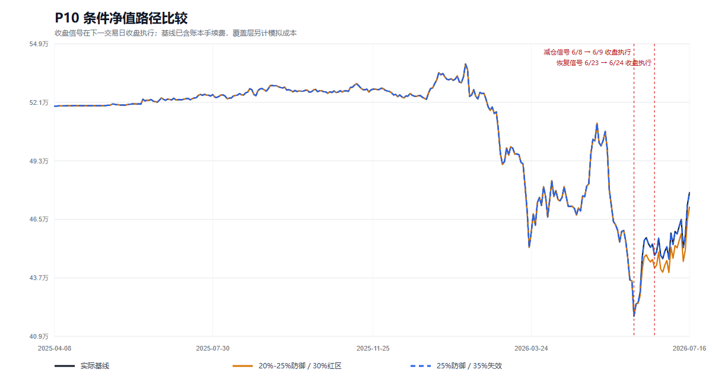

# P10 真实账户回撤验证：结论先行

本轮证据**不支持把 35% 作为常规可承受回撤，也不支持把 20% 设成只看净值就自动减仓的机械开关**。

原因不是 30% 已被证明“最优”。恰恰相反，这段真实历史的最大回撤只有 22.27%，30% 和 35% 都没有被真正触发，样本无法实证二选一。当前能证明的是：20% 防御在这条路径上出现得太晚，正好在 2026-06-08 的阶段低点发出减仓信号；采用严格的收盘执行代理后，2026-06-09 收盘完成减仓、从 6 月 10 日的收益段开始降低敞口，随后错过反弹，最终收益更差，最大回撤却没有改善。

## 三种方案的同口径结果

区间为 2025-04-07 至 2026-07-16。由于早期银证转账、个别价格代理和一项未核验持仓数量仍有缺口，以下均为**条件历史重建**，不是券商核定收益，也不是未来收益预测。

| 方案 | 期末条件净值 | 区间收益 | 条件年化 | 最大回撤 | 上涨参与度 | 额外成本 | 触发 |
|---|---:|---:|---:|---:|---:|---:|---:|
| 实际基线 | 477,862.84 元 | -7.94% | -6.50% | 22.27% | 100.00% | 0 | 0 |
| 20%/25% 防御，30% 红区 | 470,933.64 元 | -9.27% | -7.61% | 22.27% | 95.86% | 266.53 元 | 减仓 1 次、恢复 1 次 |
| 25% 防御，35% 失效 | 477,862.84 元 | -7.94% | -6.50% | 22.27% | 100.00% | 0 | 0 |

20% 防御方案比基线少 6,929.20 元。35% 方案与基线完全重合，并不表示它更好，只表示这段历史从未进入其第一个 25% 防御带。

这里的 30% 和 35% 是风险阶梯的末档触发线，不是能把最大回撤封顶的止损线：触发后模型仍保留 25% 风险敞口，尾部回撤仍可能继续穿透。后文建议把 30% 作为治理上的策略失效候选线，属于待用户确认的原则，不是本回测已经验证的“30% 硬止损效果”。

## 这次回撤真正暴露的不是“阈值太紧”

组合在 2026-01-29 达到 539,140.17 元的阶段高点，当时现金占 38.43%，持有 31 个标的，前三大仓位合计 22.48%。到 2026-06-08 的 419,053.10 元低点，现金只剩 3.48%，标的缩减到 20 个，前三大仓位已升至 66.25%。组合是在下跌过程中从“现金较多、持仓分散”转成“接近满仓、风险集中”。

高点到低点损失 120,087.07 元，其中：

- 德展健康贡献 -46,963.50 元；
- 瑞鹄模具贡献 -22,830.23 元；
- 兴发集团贡献 -22,753.97 元。

三者合计占本段损失的 77.07%。同期从组合高点到低点，沪深 300 为 -0.85%、中证 1000 为 -3.01%、中证 500 为 -6.51%，深证成指反而为 +3.64%。这支持一个重要判断：本次深回撤主要与持仓选择、仓位集中和加仓时点有关，不能归咎于大盘整体下跌；但这仍是组合归因，不是对每只股票下跌原因的完整因果证明。

真正需要前置的是个股逻辑失效、板块相对走弱、趋势恶化和组合风险贡献的联合复核。等组合已经回撤 20% 再统一砍掉 25% 敞口，往往只能被动确认已经发生的损失。

## 敏感性没有救回机械规则

- 把覆盖层滑点从 0 调到 20 个基点，20% 防御方案期末净值仍只有 470,698.13 至 471,169.21 元，均低于基线。
- 将执行收益影响延迟设为 1、2、3 个交易观察，期末净值分别为 469,757.15、470,933.64、469,417.57 元，结论不变。1 日版本只是无法拆分隔夜段时的乐观近似，不作为主结果。
- 将首个防御阈值前移到 17.5%，最大回撤只从 22.27% 降到 21.52%，却触发四次切换，期末净值降到 465,934.63 元，上涨参与度降到 88.52%。
- 用“全期现金统一增加 6,736.29 元”的非事实情景消除负现金后，防御方案期末为 477,672.33 元；必须与同情景基线 484,599.13 元比较，仍落后约 6,926.80 元。不能把它与原始基线直接比较。

## 对 30%、35% 和高收益目标的当前判断

1. **不把 35% 写成日常回撤预算。** 35% 回撤需要上涨 53.85% 才能恢复；30% 回撤需要上涨 42.86%。提高目标收益率不会自动提高可承受回撤，反而会增加恢复时间和尾部失败概率。
2. **暂保留 30% 为治理上的策略失效候选线，而不是声称已验证。** 本样本没有触及 30%，所以只能说“没有证据支持放宽”，不能说“30% 已经最优”或“模型能把回撤封顶在 30%”。
3. **20% 只做诊断和有条件防御，不做单变量自动卖出。** 是否降仓应同时看核心持仓逻辑、板块/大盘、相对强弱、趋势和流动性。
4. **先控制持仓级风险，再控制组合级回撤。** 如果 2—4 只核心股票没有事前失效条件，组合回撤阈值只是事后止血。
5. **30%—40% 年化仍只是目标。** 当前约 15 个月的条件样本为负收益，无法证明该目标可实现，更不能据此保证收益。

## 建议用户确认的风险架构

建议把下面方案作为后续正式原则的起点，而不是把某个回测参数直接投入实盘：

| 组合回撤区间 | 建议动作 | 是否机械执行 |
|---|---|---|
| 0%—15% | 正常运行，按个股失效条件和组合风险贡献管理 | 否 |
| 15%—17.5% | 进入诊断区；暂停无新证据的摊低成本，完成大盘、板块、核心持仓和趋势复核 | 否 |
| 20% 附近 | 只有在逻辑破坏、板块恶化、相对弱势或趋势破位得到至少一项实质确认时才降风险 | 条件执行 |
| 25% 附近 | 强制重做组合论证；未能证明核心逻辑仍成立时显著降仓 | 条件强制 |
| 30% | 策略失效候选硬线：停止新增风险并重构组合 | 待用户确认 |
| 35% | 灾难线，不作为常规预算；若发生说明前序控制已失效 | 待用户确认 |

工程验证已经完成，但最终参数仍由用户决定。C-HUMAN-005 保持待定；本执行器没有代替用户宣布 30%、35% 或其他数值生效。

## 证据入口

- [策略定义与时间边界](strategy_definition.md)
- [数据覆盖与缺口](data_coverage.md)
- [个人集中投资策略原则 v0.1 讨论稿](personal_concentrated_strategy_principles_v0.1.md)
- [机器可读策略比较](strategy_comparison.json)
- [敏感性结果](sensitivity_analysis.csv)
- [信号与执行日期](signal_ledger.csv)
- [回撤归因](drawdown_attribution.csv)
- [净值路径 SVG](nav_paths.svg)
- [验证摘要](validation_summary.json)

`orders_executed=false`；`guaranteed_return_claims=false`；`production_released=false`。
